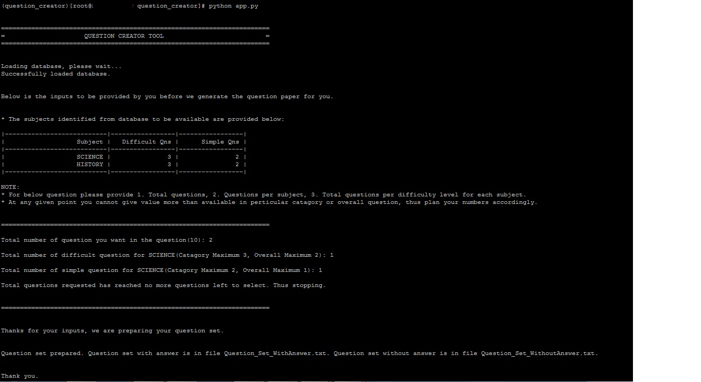

# QuestionSetCreator

Tool creates question set(with answer and without answer) by selecting random questions from the database in Excel.

To use the setup you should have Python 3 installed along with Pandas library to read MS Excel.

Fill the DB.xlsx which currently have sample data with your meaningfull data. Then execute the python script app.py will provide two question set like one provided in the sample.

Sample execution:




# Build standalone executable

```
$ pip install pandas
$ pip install xlrd
$ pip install pyinstaller
$
$ pyinstaller --onefile app.py
```

Now you will have an standalone executable(usable only on the same platform) in ***dist*** directory with name ***app***.
